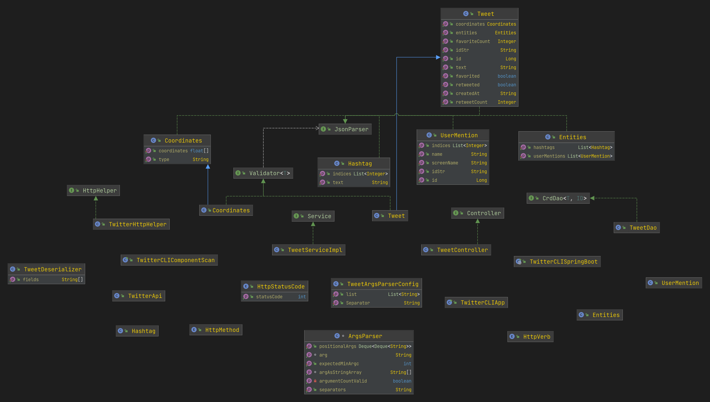

# Introduction

### What does this app do?
The TwitterCLI app serves as a CLI (Command Line Interface) client to the Twitter APIv1.1
Through this app, the user (a person or another app/service) can display a tweet, select which
fields of the tweet are displayed, post a new tweet with some options (for the time being Point
coordinates in the form of a latitude,longitude tuple), and delete one or many tweets in one go,
through tweet ids.

### What technologies have been used?
The app development rests on many layers and the tools that help handle them:

###### The Twitter API
- Represented here by the Twitter REST API v1.1., which offers Twitter CRUD-like functionality (
  twitter doesn't offer an update option, for the time being).

- The API requires, for traditional security reasons (or AAA, for Authentication Authorization and
  Accountability) to interact with it through OAuth authorization (authz) protocol.

- The authentication (authn) for this level of application (a service using the API) happens through
  shared secrets for the API key among other things. The app in this version uses the developer's
  own Twitter account authentication, access and identity.

- Because of that, the OAuth flow used will be the OAuth Client Grant Flow.
- OAuth Client Grant Flow is ideal for authz between (micro)service to (micro)service, when they are
  trustworthy enough to use that simpler and faster flow.

- Twitter offers and expansive and high quality documentation with examples to use its API.
  It also offers a free-tier for developers to test their apps interacting with the platform.

- This interaction uses HTTP protocol and its semantics, particularly HTTP GET, POST and DELETE

###### HTTP Client
The HTTP client chosen to interact with the Twitter API is
Apache's Commons HttpClient [https://hc.apache.org/httpclient-legacy/index.html]

It offers a simple model and ready-to use classes to interact with the most common HTTP tasks.
Most

###### Java libraries and frameworks
In order to represent the many twitter entities and their relationships, a Java OOP model is a
perfect application.
Combined with Spring Boot for an easier to maintain architecture and with Apache
Commons for useful utilities, Java brings here a notable added value, especially considering that
Twitter API keeps evolving.

###### Project Management Tools
Maven was chosen in part because it's industry standard, and, on the other hand, because its plugins
help build UberJars, or self-contained applications.

###### Testing
- Junit4 was chosen because it is an industry standard, with a simple semantics.
- Besides that, Mockito was chosen as the mocking library, and used mostly it's BDD semantics
  because of their expressive and fluent API.
- AssertJ was used to enhance the assertion library and add more expressive and specific assertions.

###### Tools, IDEs and misc.
- Jetbrains' IntelliJ IDEA was the go-to IDE.
- Postman was used to try Twitter API examples, verify them in closer detail, test and gather results
  from specific cases and gather sample API interactions to be used in tests.

# Quick Start and usage:

### From the stand-alone app:
```
twitterClIApp post|show|delete [options]
```

- Post/Create a tweet with latitude and longitude information:
```
twitterClIApp "post" "tweet_text" "latitude:longitude"
```

- Read/Show a tweet by its id, and display the full JSON response:

```
twitterClIApp show tweet_id 
```
- Read/Show a tweet by its id, and restrict the displayed fields to `field1` and `field2`:
```
twitterClIApp show tweet_id [field1,fields2]
```

- Delete one or a collection of tweets by their id(s):

```
USAGE: twitterClIApp delete [id1,id2,..]
```

### Using the dockerized app:

- Show a tweet by its id `1234567890123456789`
```
docker run --rm \
-e consumerKey=YOUR_VALUE \
-e consumerSecret=YOUR_VALUE \
-e accessToken=YOUR_VALUE \
-e tokenSecret=YOUR_VALUE \
jrvs/twitterCliApp show "1234567890123456789"
```

Sample JSON output:

```
{
"created_at" : "Fri Jun 26 17:32:16 +0000 2020",
"id" : 1234567890123456789,
"id_str" : "1234567890123456789",
"text" : "test post",
"entities" : {
   "hashtags" : [ ],
   "user_mentions" : [ ]
  },
"coordinates" : {
  "coordinates" : [ 79.0, 43.0 ],
  "type" : "Point"
  },
"retweet_count" : 0,
"favorite_count" : 0,
"favorited" : false,
"retweeted" : false
}
```

- Show only some selected fields for the same tweet:

```
docker run --rm \
-e consumerKey=YOUR_VALUE \
-e consumerSecret=YOUR_VALUE \
-e accessToken=YOUR_VALUE \
-e tokenSecret=YOUR_VALUE \
jrvs/twitterCliApp show "1234567890123456789" "[id,text,coordinates]"
```

Sample JSON output:

```
{
"id" : 1234567890123456789,
"text" : "test post",
"coordinates" : {
  "coordinates" : [ 79.0, 43.0 ],
  "type" : "Point"
  }
}
```


- Delete the same tweet by id:

```
docker run --rm \
-e consumerKey=YOUR_VALUE \
-e consumerSecret=YOUR_VALUE \
-e accessToken=YOUR_VALUE \
-e tokenSecret=YOUR_VALUE \
jrvs/twitterCliApp delete ["1234567890123456789"]
```

Sample JSON output:

```
{
"created_at" : "Fri Jun 26 17:32:16 +0000 2020",
"id" : 1234567890123456789,
"id_str" : "1234567890123456789",
"text" : "test post",
"entities" : {
  "hashtags" : [ ],
  "user_mentions" : [ ]
  },
"coordinates" : {
  "coordinates" : [ 79.0, 43.0 ],
  "type" : "Point"
  },
"retweet_count" : 0,
"favorite_count" : 0,
"favorited" : false,
"retweeted" : false
}
```

# Requirements
###### Tweet creation:
Creates a tweet with a geotag (latitude and longitude), then:
- On success, output the created and returned tweet object in JSON format.
- On failure, Print error message (or exception) if tweet_text length is over 140 characters,
  or if geotag is invalid (latitude or longitude is out of range)

`twitterCliApp "post" "tweet_text" "latitude:longitude"`

Arguments:
- tweet_text: tweet_text cannot exceed 140 UTF-8 encoded characters.
- `latitude:longitude`: Geo location.


###### Show/Read (with options)
Lookup a tweet by ID string, then:
If found: print the tweet object in JSON format.
otherwise, print error message (or exception) if `tweet_id` is invalid
(e.g. non-digit characters, out of range) or optional `[field1,filed2]` is invalid.

Show all fields in JSON if [field1,fields2,...,fieldN] is empty.
Otherwise, only show user specified [fields...] in the JSON document.

Print error message (or exception) if `tweet_id` is invalid.
E.g. : non-digit characters, out of range...

`twitterCliApp show tweet_id [field1,fields2]`

Arguments:
- tweet_id: Tweet ID. Same as id_str in the tweet object
- `[field1,fields2]`: A comma-separated list of top-level fields from the tweet object
  (similar to SELECT clause in SQL)

###### Delete a list of tweets (including one tweet):
Deletes a list of tweets by id, then:
- outputs the deleted tweet objects JSON representation.

`twitterCliApp delete [id1,id2,..]`

Arguments:
-tweet_ids: A comma-separated list of tweet ids.

# Design
## App architecture
### UML diagram


### Application components

###### Http and authentication/authorization components
The HttpService component and interface handle HTTP connectivity, setting up OAuth from the environmental 
variables.
The values of the authentication/authorization keys are generated on the Twitter
Developer dashboard.

- In OAuth context, each API request has to be signed by passing several generated keys and tokens
  in an authorization header.
  These consist of:
- API key and secret: OAuth consumer key and OAuth consumer secret.
  These can be considered as the username and password that represents a Twitter developer app when
  making API requests.
- Access token and secret: OAuth access token and OAuth access token secret
  An access token and access token secret are user-specific credentials used to authenticate
  OAuth 1.0a API requests. They represent the Twitter account the request is made on behalf of.

HttpService handles and hides all these details, and hands the Apache Commons HttpClient a ready-
to use HTTP connection context.

###### App/main/entry-point
This is the entry-point for the app.
The main app sets up the Spring Context with the Spring
components configuration and starts the main app where the components have been injected by Spring
Boot IoC

###### Controller
The controller later handles cli interface first line of validations, extracting the relevant arguments
from the command line, casting them or transforming them into the correct data structure to
be consumer by the service, and choosing the right service to invoke based on the command options

###### Service
The service component handles the app business logic. In this app, business logic is not
complicated, but the service component runs a few validations to ensure the tweet data is in the
correct format and within the specific limits. for example, it ensures that the longitude and
the latitude values are in the correct number format and within the GeoJson range (as documented in
Twitter data dictionary).

###### Validation
To decouple validation functions in this layer and allow future extensions, validations have been
regrouped in this component.

###### DAO
The Data Access Object component (and pattern) in this project acts as an intermediary between
the service/business logic layer, and external data storage and/or sources, such as secondary
storage, REST API, GraphQl API, an RDBMS or a NoSQL Database.

###### DTO or DTO-like serialization and deserialization
This project is simple enough that at this stage it doesn't require to use a DTO data pattern.
However, because JSON serialization and deserialization is a cross-cutting concern, the methods
and abstract methods associated with JSON processing have been regrouped into this interface.

## Models
### Tweet model
The tweet model is based on Twitter's Data Dictionary for Twitter API V1.1
It is a simplified version, for practical reasons (time constraint on the project).
However, it is also designed to be extensible, mirror the Twitter Data Model JSON structure,
and adds utility methods to make using the model easier, as well as abiding by OOP fundamentals
of encapsulation.

All Tweet's model property has been declared with primitive wrapper classes for two purposes:
- use `null` to express lack of information about the property
- make the work of JSON marshalling/unmarshalling more consistent
- put to work Java standard library's utilities for primitive wrapper classes, especially when it
  comes to conversion and validation
- allow future refactoring into Collections and lambdas, as these favour Object types
  instead of primitive types

The encapsulation afforded to use a more expressive representation of some twitter data types,
like the `created_at` field, returned as one string, but here modelled as a `ZonedDateTime` class
to make time and date manipulation simpler in the future.

### Object Model:
The JSON Object Model is a pragmatic simplification of the Twitter Data Dictionary v1.1:
https://developer.twitter.com/en/docs/twitter-api/data-dictionary/object-model/tweet

- id (default):	int64 (note: the int64 53bits restriction and issues for Javascript/ECMAScript
  does not apply to Java)
- id_str (default): string (must be equal to id in value)

- text (default):   string (For specific and restrictions from Twitter:
  https://github.com/twitter/twitter-text)

- created_at:  date (ISO 8601)

- entities : object of {
  - hashtags: list of hashtags[ ]
  - user_mentions: list of [ ]
    }

- coordinates: object of {
  - coordinates: list of
    - [ longitude: float32
    - latitude: float32 ]
  - type: string, always `"Point"` in this project }

- retweet_count: 0
- favorite_count: 0
- favorited: false
- retweeted: false


###### Tweet ID
Example: `{"id": 10765432100123456789, "id_str": "10765432100123456789"}`

## Spring
The Spring version of the app manages dependencies by using the pattern of DI (Dependency Injection).
DI is also known as IoC, for Inversion of Control.
The dependencies are managed by creating a Spring Context, configuring it, and declaring
dependencies as Components (including as Service, Repository, etc...). The annotations used to
declare dependencies as components also allow the Spring Context to choose the correct dependency
to inject into the relevant Object when it's declared.

# Test
Testing the app using Junit and mockito:

- Gather tweet examples from specific inputs and their resulting outputs
- Use Junit to set up test fixtures and samples
- Use Mockito to mock similar expected return of methods and objects to narrow down on Subject Under
  Test (SUT) for unit tests, using the shape of the twitter object and twitter Data Dictionary v1.1
  to make the mock as close to reality as possible.
- Use example fixtures and feed that data to SUTs in Integration tests
- Use Junit facilities to test for expected exceptions
- In both cases, use assertions to compare the actual result with the expected result
- Naming the methods accurately and adding comments is necessary, especially to describe mocks
  because they only contain partial truth about the model and its behaviour
- For most of the project's classes, TDD has been followed, by writing tests first and the expected
  result or behaviour, then making the SUT behave as expected to turn the test green, from red.

## Deployment
Through dockerizing the app:

- Using UberJar, maven plugin and a Dockerfile
- maven + maven plugin packages the app
- running Docker build with the Dockerfile's instruction builds a new image
- The image is uploaded to Docker repository

Running the app with docker:

```
docker pull jrvs/twitter_app

docker run --rm \
-e consumerKey=YOUR_VALUE \
-e consumerSecret=YOUR_VALUE \
-e accessToken=YOUR_VALUE \
-e tokenSecret=YOUR_VALUE \
jrvs/twittercli post "test post" "43:79"
```


# Improvements
- Replace `null` with Optional
  this will allow clarifying the business logic when it comes to optional values or successful API
  response (not throwing an exception) that is otherwise inconsistent with the app model.
- It will also help narrow down on the `NullPointerException` induced by bugs, and make testing
  simpler or more expressive.
- Use more lambdas and streaming, as Twitter API responses could be significantly large, and using
  lambdas can help simplify handling these.
- Use multithreading, for the same data size growth concern, as tweets are independent objects and
  their processing can take advantage from making the tasks parallel.