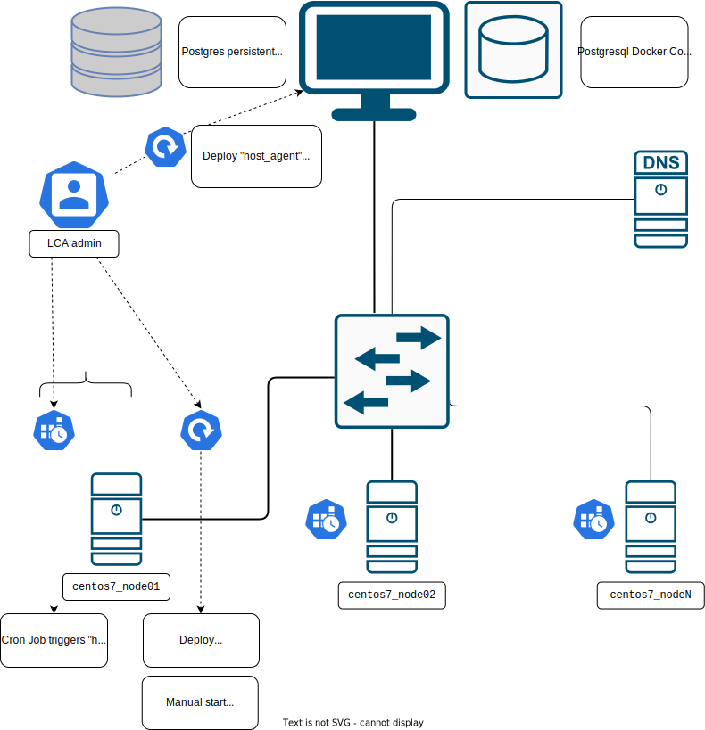

# Linux Cluster Monitoring Agent

# Introduction
The Jarvis Linux Cluster Administration team (LCA) manages a cluster of Linux nodes at the Company (Jarvis Consulting).
The LCA needs to collect data about the Linux nodes it's using, for multiple purposes, including documenting its assets
as automatically as possible, node enumeration and monitoring, and in order to generate reports for future resource
planning and provisioning.

## Overview and Business Needs
This project aims to provide the LCA team a set of tools (the Linux Cluster Monitoring Agent) to gather the hardware
specifications of each node of the Linux cluster that the team manages, to gather each node's resource usage in as close
to real-time as reasonable for this purpose, and to collect all that data in a centralized RDBMS that can be easily
set up and managed on an LCA member workstation. The Cluster Monitoring Agent (LCMA) will be composed of agents running
on the nodes themselves (host agents) and an agent running on the LCA admin workstations (LCMA DB agent).

In order to keep the project simple and cost-effective, with accessible future updates and auditing on one hand,
and as portable as possible, it is recommended to use a FOSS (Free and Open Source) scripting language that is available
everywhere and use the platform's available tools.

The deployment itself, for now, is going to be handled by the LCA team.

## Prerequisites and Environment Survey:
The current Linux cluster comprises 10 nodes of Centos Linux 7, a derivative of RedHat Enterprise Linux(tm) and
a POSIX-compliant Linux distribution (or distro) which comes by default with GNU and Systemd userspace.

### Available Free and Open Source Software tools:
The userspace includes:
- scripting engine: bash as ubiquitous default shell, with sh/POSIX compatibility and with some useful but
  incompatible extensions ("bashisms")
- The Linux Kernel exported virtual filesystems /proc and /sys which can conveniently be access by many FOSS
  monitoring tools in the distro.
- openssh client and server for remote and secure access
- openGPG/PGP for encryption/signature verification
- standard Linux tools for job scheduling and periodical polling, such as cron/crontab/cron jobs
- iptables for network stack management/query
- default Centos 7 repositories include:
    - git for Source Versioning System
    - Postgresql as the RDBMS for the LCMDB
    - psql, a cli/shell postgresql client, to write data on the remote DB instance.
    - Docker as a container technology.
    - an FOSS dockerized and verified copy of postgresql pulled from dockerhub (official docker images repository)

### Networking
These nodes are internally connected through a L2 network switch. The host agents do not need, for now, any specific
configuration. The nodes are assigned ipv4 addresses and a hostname through internal DHCP and DNS servers.
The host agents will need to communicate (write-only) with the LCMA DB using its hostname or ipv4 address.
That information will need to be updated manually on the scripts before they're redeployed manually.

### Preliminary Security Considerations:
Security should be considered early in the design. Due to the MVP nature of this project, at this stage, the security
considerations are important to keep in mind but are to be implemented for a future release.

# Quick Start
- Start a container instance using `psql_docker.sh`
- The previous step will create the tables, but these can also be created manually using `ddl.sql`
- Insert initial hardware specs data into the database using `host_info.sh`
- configure crontab to execute periodically `host_usage.sh`. 
- The previous step will insert hardware usage data into the database, but the script can also be used manually.

# Implementation
The project will be implemented using the Agile methodology, to be able to test frequently if each feature fits the MVP
requirements and the LCA team business needs.

The Linux Cluster Monitoring Agent (LCMA) and The Linux Monitoring Database (LCMDB) can be developed independently
of each other.

The LCMA is sub-divided into 2 scripts:

- `host_info.sh` gathers the local host hardware information, during its first startup after deployment, or on
demand. The info will be inserted into the LCMDB using psql, a local cli/shell database client.

- `host_usage.sh` is triggered each minute by `cron` (or similar), gather current host statistic in a reasonable time
(miliseconds) and insert that data into the LCMDB, again using `psql` command.

- Note: `host_info.sh` must be the first script to start, in order to initialize relevant host information in the DB,
that `host_usage.sh` will make use of.

- In order to create the cronjob, at this stage, a manual edit of contabs can be performed by a sysadmin.
An improvement on this design could be that host_info.sh updates the crontab itself on lauch, and host_usage.sh will
error if it's started before `host_info.sh` and/or a crontab entry was not present.

- The scripts can be started on boot by adding the relevant startup scripts in `/etc/rc.d` or on the systemd entries.

The LCMDB has 2 components:
- A psql_docker.sh script that serves to:
- download and/or setup a postgresql docker container
- create a postgresql local volume (to persist the DB independently of the docker container)
- start that container (by default named "jrvs-psql")
- create a new DB (by default "host_agent")
- and finally configure its schema, before starting to listen on the postgrsql port (by default `5432`).
- __Note__: A sysadmin needs to ensure the postgresql DB port is mapped to an ingress open port on the LCA
workstation's firewall, or manually open it. That step can be later automated.
- The `psql_docker.sh` can also start and stop the LCMDB container. This option is convenient to hide the docker usage
details for the LCA admins and make the script usage more intuitive and portable if another container technology is
chosen instead of docker at a later time.

The implementation will use bash scripting, and try to stick to the most POSIX-ly correct way for a Unix shell script,
for future portability. In case a "bashism" is needed, that choice must be documented.
For the same purpose, the script will use the most common Linux monitoring commands or utilities, such as `vmstat`, for
because these have well documented behaviour and have known equivalent in other operating systems.
The choice of the OS monitoring tools will have to go through the Tech Lead/Senior Developer for validation.

The scripts will make sure to validate:
- The environment compatibility, including environment variables that the scripts will need
- The availability and/or correctness of the Network Time Service (NTP) as these script use timestamps
- The availability of the tools that are used by the scripts, including `docker, psql, sed, awk, vmstat, cron` etc...
- The input arguments (first checking their syntax and number, then later, their types and other constraints)
- The availability of networking by `ping`'ing the remote host/port, and preferably the remote postgresql instance
- The success or failure of each step by checking the last exist code for non-zero/failure/error codes

Each operation that the script is doing should be displayed on stderr for troubleshooting. However, that option can be
configured through a debug variable or parameter.

## Architecture
(A schematic diagram included)


## Scripts
Here are the shell scripts included in the project, as well as some gotchas and examples:

### `psql_docker.sh`
Usage: `psql_docker.sh start|stop|create [db_username][db_password]`

Example: `./scripts/host_info.sh "localhost" 5432 "host_agent" "lca_username" "lca_password"`

This script must be run on the admin workstation. 
It creates, sets up and starts a new Postgresql docker container (and pulls it in case there is no container image).
Its defaults are:
  - Container name: "jrvs-psql"
  - Image name: "postgres:9.6-alpine"
  - Default port mapping (local:container): "5432:5432"
  - Default host: "127.0.0.1"
  - Default database name: "host_agent"
  - Default local (persistent) volume: "pgdata"

The script issues warning if trying to start or stop a container in the wrong state.
Please note that stopping a container with `./psql_docker.sh stop` will not remove it. You will need to issue manually 
a `docker container rm`. After the removal of the container, the data will persist in "pgdata", as it doesn't get
removed automatically.   This ensures that the data can be backed up or recovered independently of the postgresql docker
container or image.

### `host_info.sh`
Usage: `host_info.sh psql_host psql_port psql_db_name psql_username psql_password`

Example: `./scripts/host_info.sh "remote_host" 5432 "host_agent" "lca_username" "lca_mypassword`

This script is intended to be run first, manually, or automatically, right after the deployment.
This script gathers local machine hardware info and populate the database table of the same name
running this script before running `host_usage.sh` is critical as the latter depends on the `host id` key created for 
this script.

### `host_usage.sh`
Usage: `host_usage.sh psql_host psql_port db_name psql_user psql_password`

Example: `./scripts/host_info.sh "localhost" 5432 "host_agent" "lca_username" "lca_password"`

This script is intended to be run or triggered periodically by `crontab`

### `crontab`
The cron table must be edited to trigger running `host_usage.sh` periodically. The period is defined to be 1 minute.
Please issue these commands on the cli (or consult with your sysadmin for further information)

```
* * * * * bash /home/centos/dev/jrvs/bootcamp/linux_sql/host_agent/scripts/host_usage.sh  localhost 5432 host_agent \ 
postgres password > /tmp/host_usage.log
```

__Note__: crontab content can be verified with `crontab -l`. Please refer to `man crontab` for further options.

For troubleshooting, run your host_info.sh script command using the full path (with no contab syntax, i.e the 5 `*`)
If you don't get any error message, it means that the command (with full path and arguments) is running correctly, and 
ready to be added as it is to the cron table using `crontab -e` and the above syntax above (`\` should not be
entered, as it shows a line continuation. Instead, the whole line should be entered with no backslash)

### `queries.sql`
The project includes some SQL queries requested by the LCA team. 
These are included in the `sql/queries.sql` folder.

#### Query to rank nodes by a basic performance ranking (Number of CPU, memory sizes)
This query groups hosts by CPU number, then sorts them by their memory size in descending order.
This can give the LCA team a simple but good overview about 2 of the most important hardware capabilities of the nodes.

#### Query to find out the average used memory in percentage for each host
This query computes the average used memory, in percentage, for each host. 
To approximate the value, the calculation is made over a 5 minutes interval for each host. Ideally, 5 data points will
be available to measure the 5 minutes average. Used memory is computed from (total memory - free memory).

#### Query to detect host failure
The assumption is that an active host is collecting one usage datapoint per minute. This means that if a host is down or
experiencing difficulties, the number of queries will get closer to 0. In order to take into account other random issues
including network problems and intermittent issues, 2 data points or less, per 5 minutes has been deemed representative
of this metric. 
Thus we can assume that a server is failed when it inserts strictly less than three data points within 5-min interval.

## Database Modeling
The "host_agent" database schema is defined in the `ddl/sql` file.
It is used by `psql_docker.sh` after it sets up and start the postgresql docker container to create the tables used by
the 2 other scripts running on the host nodes.

`host_info`
|id|hostname|cpu_number|cpu_architecture|cpu_model|cpu_mhz|L2_cache|total_mem|timestamp|

`host_usage`
|host_id|memory_free|cpu_idle|cpu_kernel|disk_io|disk_available|timestamp|

# Test
The tests consist of running the agents and the database in a known environment and comparing the accuracy and timeness
of the recorded data with the information locally validated. At this stage, a visual comparison is enough.
Future tests can involve simulating different network conditions using Centos 7 test VMs, and different hardware and
software states created by stress testing the VMs and/or modifying virtual hardware on the fly.

# Deployment
The tool deployment has 2 sides:
1. The Database and the RDBMS can be deployed manually by the LCA sysadmins on their local machines.
   (note: multiple simultaneous deployments of the database can exist without conflicting, considering that collected
data is immutable)
2. The node's local agents can be deployed using either Kickstart unattended install for Centos 7, and/or by adding the
agent source code to the team hosted Github repository and manually modifying `crontab` to periodically check for the
agent repository updates, pulling the latest one and running it locally. A simpler option, considering that there are
so far 10 machines, would be to deploy and run the agents manually on each node.

# Improvements

### Deployment
- Deploy using Ansible/Puppet/Chef
- Update bash script to make it POSIX compliant for portability (in case FreeBSD nodes were deployed later)

### Fault-tolerance
- Update the agents to record locally the collected data in case of network failure

### Security considerations
Due to the need for hardware access, the tools running on the nodes will need privileged access in read-only mode.
This could still pose potential security risks. Some readily available solutions can minimize these risks:

- Create a dedicated user/group and enforce Mandatory and Discretionary Access Control (MAC and DAC) using SELinux to
  ensure the agents privileged software and hardware access is as restricted as possible.
- If available, using optionally SELinux more advanced access control and auditing features
- GPG/PGP signing the scripts, and/or using sha256 checksums, as the host agent scripts are not supposed to be
  updated frequently
- Using ssh to encrypt and tunnel communications between the nodes and the main database, to prevent or limit network
  recon and/or Machine In The Middle attack (MITM)
- Configuring local hosts auditing and alerting in case of a detected modification, as well as the database
  invalidation
- Add to the database schema a key/token for the agent authentication and integrity checking to prevent tampering

The MVP will contain hardcoded configuration information. Extra-caution needs to be taken when deploying it on a git
repo, including if it's an internal one. If pushed to a public git hosting such as Github, the hardcoded information
**must be removed** and replaced by environment variables.

For the time being, the MVP will be deployed on a few local machines and servers within the IT network.

The MVP is configured with debug mode to display extra information about its execution. This can be turned off or removed
later, and has no impact on its execution.


- Create a dedicated user/group and enforce Mandatory and Discretionary Access Control (MAC and DAC) using SELinux to
  ensure the agents privileged software and hardware access is as restricted as possible.

Nissa N. Elchhab


